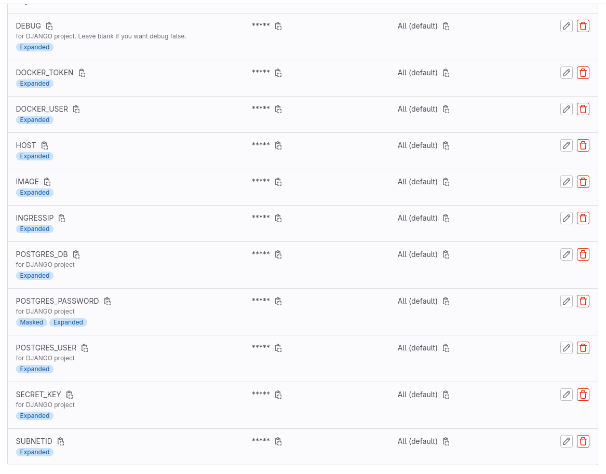
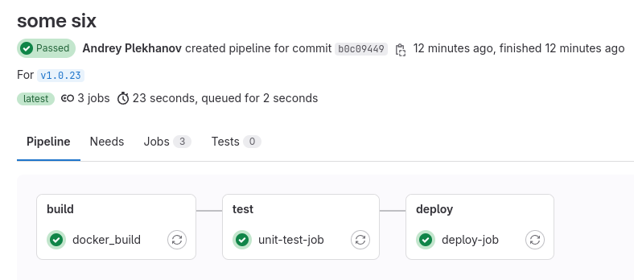
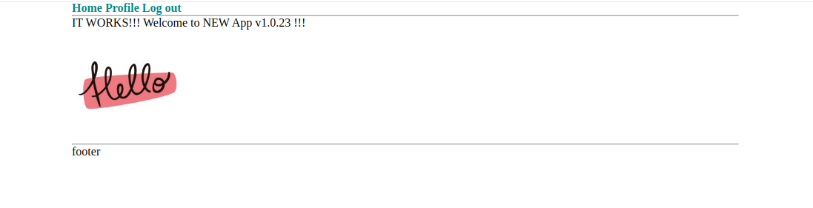

# sf-diploma-sprint2

## Задача
```
1. Клонируем репозиторий, собираем его на сервере srv.
Это простое приложение на Django с уже написанным Dockerfile.
Приложение работает с PostgreSQL, в самом репозитории уже есть реализация docker-compose — её можно брать за референс при написании Helm-чарта.
Необходимо склонировать репозиторий выше к себе в Git и настроить пайплайн с этапом сборки образа и отправки его в любой docker registry. 
Для пайплайнов рекомендуем GitLab.

2. Описываем приложение в Helm-чарт. Стоит хранить данные в БД с помощью PVC в Kubernetes.

3. Описываем стадию деплоя в Helm.
Настраиваем деплой стадию пайплайна. Применяем Helm-чарт в наш кластер. 
Нужно сделать так, чтобы наше приложение разворачивалось после сборки в Kubernetes и было доступно по бесплатному домену или на IP-адресе с выбранным портом.
Для деплоя должен использоваться свежесобранный образ. 
По возможности нужно реализовать сборку из тегов в Git, где тег репозитория в Git будет равен тегу собираемого образа.
Чтобы создание такого тега запускало пайплайн на сборку образа c таким именем hub.docker.com/skillfactory/testapp:2.0.3.
```

## Решение

### Регистрируем хост
1. Зарегистрировал доменное имя `andryplekhanov.ru` на reg.ru и подключил его к DNS Яндекса `ns1.yandexcloud.net` и `ns2.yandexcloud.net`.
2. На Яндекс-облаке создал публичную зону `andryplekhanov.ru.` и wildcard A-запись `*.andryplekhanov.ru.`, указывающую на IP балансировщика (`load_balancer_public_ip`), который мы получили на предыдущем спринте.

<hr>

### Создаём проект на Gitlab и регистрируем раннер на управляющем сервере
1. Создал новый репо на Gitlab, перенёс сюда django-приложение.
2. Добавил новый раннер в проект: `Settings - CI/CD - Runners - New project runner` и получил команду для его регистрации: `gitlab-runner register --url https://gitlab.com --token <токен>`.
3. Зашел на сервер **srv**: `ssh ubuntu@<external_ip_address_srv>`, залогинился под sudo: `sudo su` и применил там вышеуказанную команду. Экзекьютор выбрал **shell**.

<hr>

### Настраиваем свой Dockerhub
1. Идём на Dockerhub. Создаём репо проекта. Записываем себе его название в формате `myusername/myprojectname`.
2. Переходим в раздел `My account / security` и регистрируем новый токен с правами `Read & Write`. Записываем себе username и токен.

<hr>

### Создаём приватные переменные для проекта
1. Идём на Gitlab в наше репо, переходим в раздел `settings/ci_cd/variables`
2. Добавляем все переменные, необходимые для проекта: 
```
POSTGRES_DB: <название базы данных>
POSTGRES_USER: <имя пользователя базы данных>
POSTGRES_PASSWORD: <пароль для базы данных>
SECRET_KEY: <секретный ключ из настроек Django-приложения>
DEBUG: <оставить пустым, если не хотим, чтобы приложение работало в debug-режиме>
IMAGE: <название репо в dockerhub в формате myusername/myprojectname>
DOCKER_USER: <username из dockerhub>
DOCKER_TOKEN: <токен из dockerhub>
HOST: <зарегистрированное доменное имя в формате test.mysite.ru>
INGRESSIP: <ip созданного ингресс-контроллера instance_group_ingresses_public_ips>
SUBNETID: <id подсети, в которой находится ингресс-контроллер>
```
**Результат:**


<hr>

### Пишем helm-chart
Создал директорию `./k8s/helm/`, где создал helm-chart.

Структура чарта:
```
.
├── k8s
│   └── helm
│       ├── values.yaml
│       ├── Chart.yaml
│       ├── templates
│       │   ├── app.yaml
│       │   ├── app-secrets.yaml
│       │   ├── _common.tpl
│       │   ├── postgres.yaml
│       │   └── postgres-secrets.yaml
```
В директории `./k8s/helm/templates` созданы манифесты:
- в `app.yaml`: описаны **deployment**, **service** и **ingress** django-приложения
- в `postgres.yaml`: описаны **deployment**, **service** и **PersistentVolumeClaim** базы данных
- в `app-secrets.yaml`: описаны секреты для **app**
- в `postgres-secrets.yaml`: описаны секреты для **postgres**

В файле `./k8s/helm/values.yaml` собраны всё необходимые настройки для **app** и **postgres**.

<hr>

### Пишем пайплайн для сборки и деплоя

Создал файл `.gitlab-ci.yml` и описал этапы сборки и деплоя.
В пайплайне используются все созданные ранее переменные.

**ВНИМАНИЕ!** Все джобы запускаются только из тегов

**На этапе сборки** происходит логин в наш Dockerhub, сборка образа приложения из Dockerfile (тег подставляется автоматически) и выгрузка готового образа на Dockerhub.

**На этапе деплоя** происходит запуск команды `helm upgrade --install django-release` с автоматической передачей в проект всех необходимых переменных.

<hr>

### В ИТОГЕ
1. В итоге нужно закоммитить и запушить изменения: `git add . && git commit -m 'some six' && git push`
2. Затем проставить и запушить тег: `git tag v1.0.23 && git push origin v1.0.23`. **Только тогда запустится пайплайн.**

**Результат выполнения пайплайна в Gitlab:**


**Результат развёртывания приложения в браузере:**



**ВНИМАНИЕ!** Для администрирования Django-приложения через админ-панель необходимо **создать суперпользователя**. Для этого на управляющем сервере **srv** выполняем команды:
- заходим внутрь контейнера: `kubectl exec -it deployment.apps/app-deployment  -- sh`
- создаём суперпользователя: `python manage.py createsuperuser`
- вводим необходимые данные и нажимаем `Ctrl + D` для выхода
- теперь можно войти в админ-панель по адресу `http://<your_site>/admin`

<hr>

## DOCKER COMPOSE DEPLOY (для справки)
- Скачайте проект и перейдите в него: `git clone https://gitlab.com/andryplekhanov/dj-project.git && cd dj_project`
- Создайте файл ".env" из файла ".env.dist" и отредактируйте его: `mv .env.tpl .env && vi .env`
- Запустите сборку контейнеров и сами контейнеры `docker compose build && docker compose up -d`
- Примените миграции: `docker compose exec app sh -c "python manage.py migrate"`
- Создайте суперпользователя: `docker compose exec app sh -c "python manage.py createsuperuser --no-input"`
- Запустите сбор статики: `docker compose exec app sh -c "python manage.py collectstatic --no-input --clear"`
- Откройте приложение в браузере: http://0.0.0.0:8000/
- Доступ в админку: http://0.0.0.0:8000/admin
