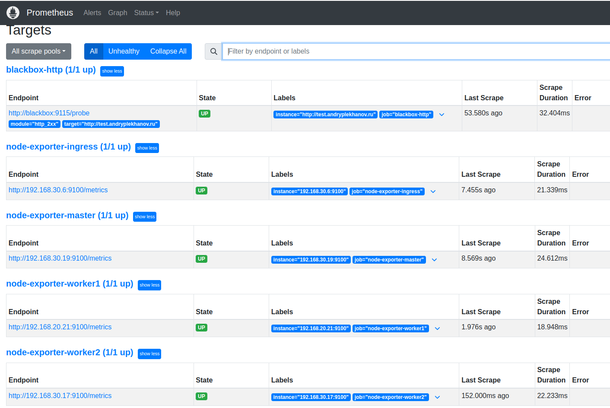
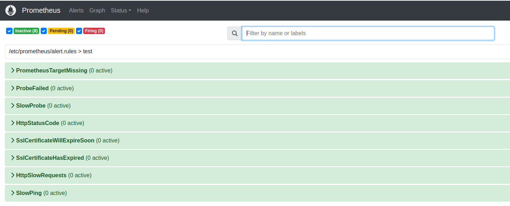
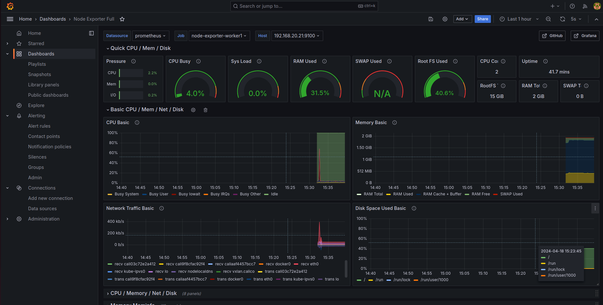
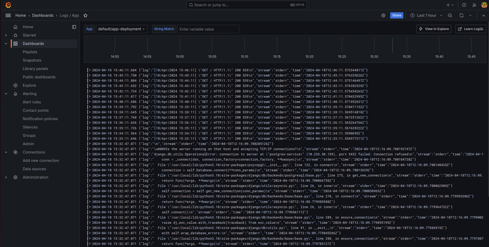
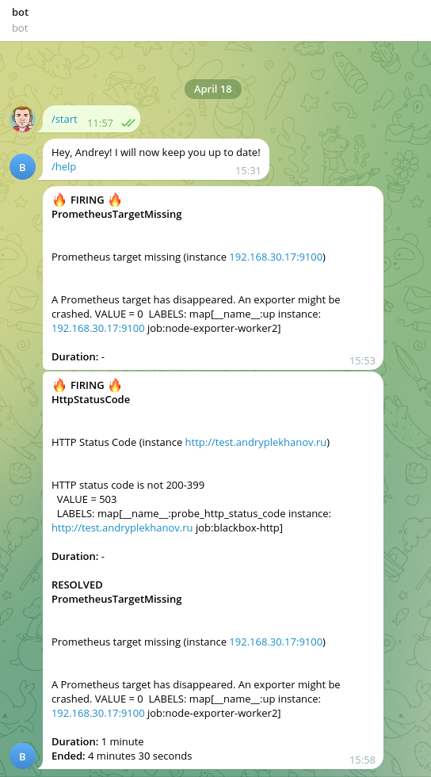

# sf-diploma-sprint3


## Задача
```
1 Настройка сборки логов.
Представьте, что вы разработчик, и вам нужно оперативно получать информацию с ошибками работы приложения.
Выберите инструмент, с помощью которого такой функционал можно предоставить. Нужно собирать логи работы пода приложения. Хранить это всё можно либо в самом кластере Kubernetes, либо на srv-сервере.

2 Выбор метрик для мониторинга.
Так, теперь творческий этап. Допустим, наше приложение имеет для нас некоторую важность. Мы бы хотели знать, когда пользователь не может на него попасть — время отклика, сертификат, статус код и так далее. Выберите метрики и инструмент, с помощью которого будем отслеживать его состояние.
Также мы хотели бы знать, когда место на srv-сервере подходит к концу.
Важно! Весь мониторинг должен находиться на srv-сервере, чтобы в случае падения кластера мы все равно могли узнать об этом.

3 Настройка дашборда.
Ко всему прочему хотелось бы и наблюдать за метриками в разрезе времени. Для этого мы можем использовать Grafana и Zabbix — что больше понравилось.

4 Алертинг.
А теперь добавим уведомления в ваш любимый мессенджер. Обязательно протестируйте отправку уведомлений. Попробуйте «убить» приложение самостоятельно, и засеките время от инцидента до получения уведомления. Если время адекватное, то можно считать, что вы справились с этим проектом!
```


## Решение

В качестве решения был выбран стэк мониторинга **Prometheus + Loki + Grafana + Alertmanager**.

Разворачивать будем всё при помощи ролей **Ansible**.

<hr>

### Общая логика
1. На все ноды кластера и сервер **srv** устанавливается **node-exporter**, для мониторинга самих хостов.
2. На все ноды кластера устанавливается **promtail** для сбора логов.
3. На сервере **srv** разворачиваются:
   - prometheus, grafana - для сбора метрик и их визуализации;
   - loki для сбора логов от promtail;
   - blackbox - для мониторинга веб страницы с приложением;
   - alertmanager и alertmanager-bot для алертинга.


<hr>

### Описание ролей

**exporters**:
1. На целевых серверах создается директория `/opt/node-exporter`, в неё копируется **dockercompose.yml** файл из директории `files` роли, далее с помощью **docker compose** запускаются сервисы **node-exporter** на хостах.

**monitoring**:
1. На сервере **srv** создаются поддиректории для будущих сервисов в директории `/opt`.
2. На сервер **srv** копируется **docker-compose.yml** файл, который формируется из шаблона **docker-compose-template.j2**. Для формирования файла используются переменные зашифрованного с помошью ansible-vault файла `vars/main.yml`, в нём содержится токен бота и id пользователя.
3. Конфигурация для **node-exporters** формируется динамически, с помощью шаблона **exporters.yml.j2** на основе данных указанных в файле **hosts**.
4. Далее копируются все необходимые файлы конфигураций из директории files, и сервисы запускаются с помощью **docker compose**.

**logging**:
1. На сервере **srv** создаётся директория `/opt/promtail`, в неё копируется `values.yml` файл.
2. **Promtail** разворачивается с помощью готового **helm-чарта** из репозитория https://grafana.github.io/helm-charts в отдельном namespace **logging**.

<hr>

### Запуск ролей

1. Запускать роли необходимо с сервера srv. Клонируем репозиторий: `git clone https://gitlab.com/andryplekhanov/monitoring.git` и переходим в него: `cd monitoring`
2. Редактируем файлы:
   - **hosts**, вбиваем приватные адреса нод кластера и сервера srv.
   - **roles/logging/files/values.yml**, вбиваем приватный адрес сервера srv.
   - **roles/monitoring/files/prometheus.yml**, вбиваем url-адрес своего сайта (строка 19).
3. Редактируем файл **roles/monitoring/vars/main.yml** командой `ansible-vault edit roles/monitoring/vars/main.yml`
Данный файл зашифрован при помощи **ansible-vault**, пароль - `zyHCVr6nWN@n`.
Вбиваем данные: id пользователя и токен Telegram-бота.
4. Выполняем команду `export ANSIBLE_HOST_KEY_CHECKING=False`, чтобы Ansible не запрашивал подтверждение при подключении к серверам.
5. Запускаем поочерёдно три роли:
   - `ansible-playbook -i hosts playbook.yml -t exporters --ask-vault-pass`
   - `ansible-playbook -i hosts playbook.yml -t mon --ask-vault-pass`
   - `ansible-playbook -i hosts playbook.yml -t log --ask-vault-pass`

   При каждом запуске необходимо ввести пароль для декрипта файла с переменными `zyHCVr6nWN@n`


В итоге имеем:
- **Grafana** доступна по публичному адресу сервера **srv** на порту 3000 - http://158.160.41.131:3000/
- **Prometheus** на том же адресе, на порту 9090 - http://158.160.41.131:9090/

В **Prometheus** на вкладке "**Targets**" должны появиться все таргеты со статусом "UP", а на вкладке "**Alerts**" - правила алертинга.





<hr>

### Настройка Grafana

1. Заходим в интерфейс **Grafana**. Логин и пароль **admin** и **admin**.
2. Добавляем **Data source** для **Prometheus**: `http://prometheus:9090/`
3. Добавляем дашборды:
   - импортируем готовый шаблон для **node-exporter** с id - **1860**. В качестве источника указываем **Prometheus**.
   - импортируем готовый шаблон для **loki** с id - **13639**, в качестве источника указываем **loki**.
   - импортируем готовый шаблон для **blackbox** с id - **7587**. В качестве источника указываем **Prometheus**.

В итоге имеем дашборды со всеми метриками, логи и алертинг:






